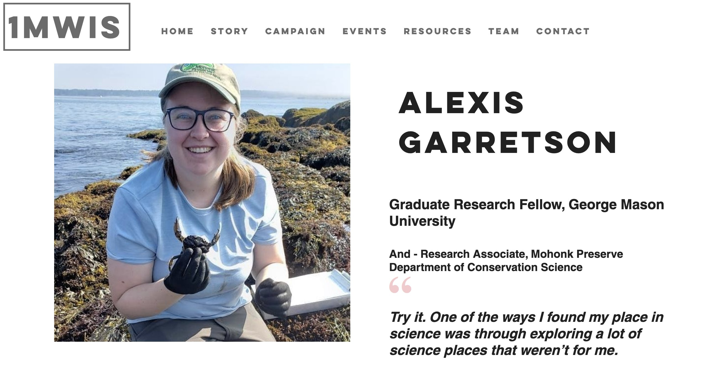

I'm so excited to add my name to the list of 1 Million Women In STEM. I got to share about how trying things out, including getting involved with Earth Science Information Partners (ESIP), has helped me find my place as a woman in STEM.

My advice to any woman interested in STEM is "Try it"! There are so many ways to be in a STEM field, and I didn't even know the types of research/science work I get to do every day now were even an option until I had the opportunity to give them a try. 

[Check it out](https://www.1mwis.com/profiles/Alexis-Garretson)