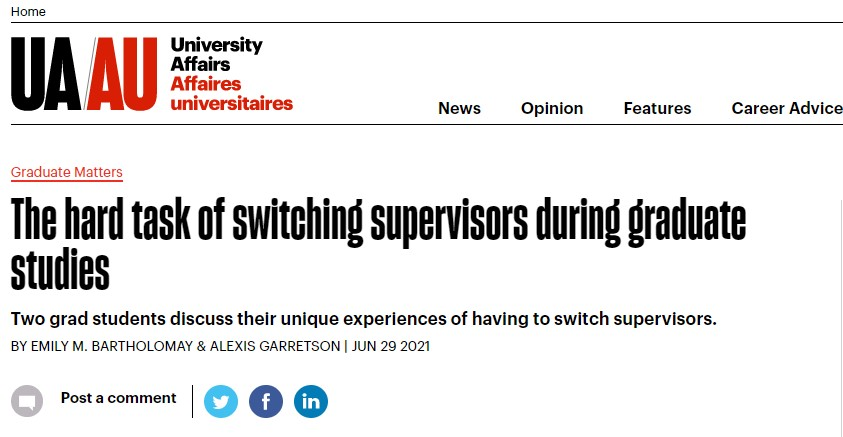

Switching supervisors during graduate studies can be hard. Here's some advice from myself and another student who changed advisors during grad school on how to determine if its the right choice for you.
[Check it out](https://www.universityaffairs.ca/career-advice/graduate-matters/the-hard-task-of-switching-supervisors-during-graduate-studies/)