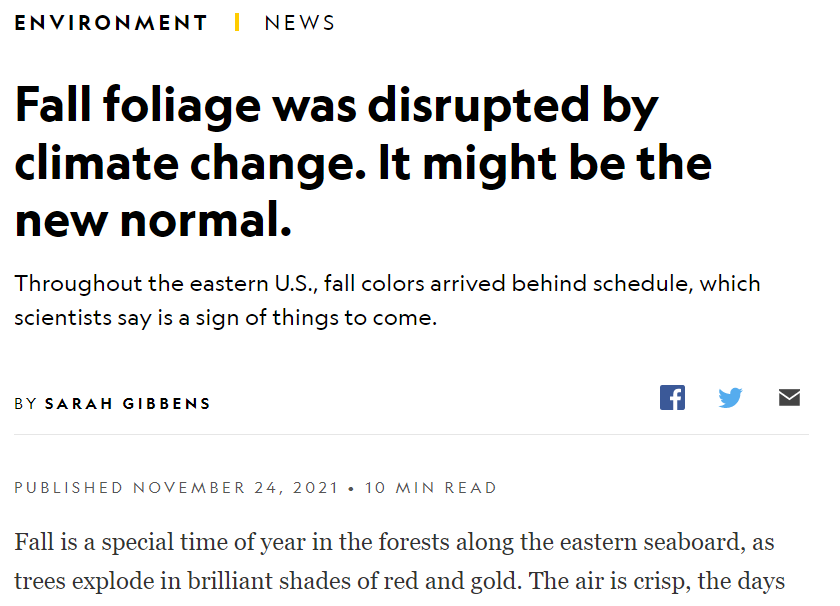

This piece highlights recent work from Dr. Rebecca Forkner and I on the timing of fall colors in the eastern united states. 
[Check it out](https://www.nationalgeographic.com/environment/article/fall-foliage-disrupted-by-climate-change-might-be-new-normal)